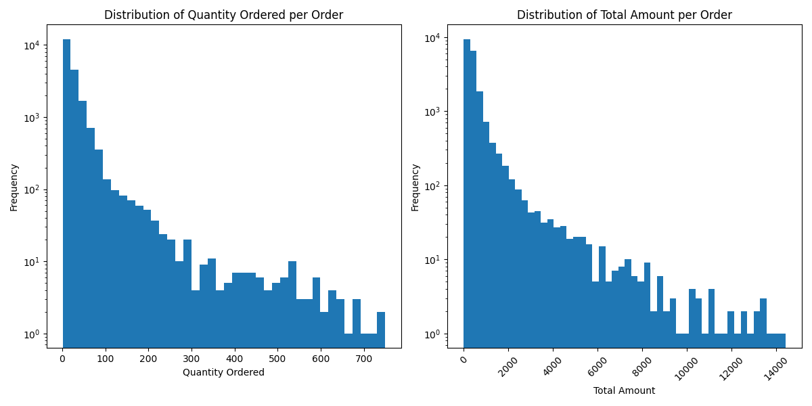

# **Customer Behavior and Sales Analysis**



## Project Overview

This project involves analyzing sales and customer behavior using MS SQL for database management and querying, and Python for data cleaning and visualization. The data is sourced from Kaggle and processed to gain insights into customer behavior and sales trends.

## **Project Structure**

The project directory is organized as follows:

- **data/**: Contains data files.
  - **rawData/**: Original, unprocessed data files (gzip-compressed).
  - **cleanedData/**: Cleaned and processed data files.
  - **exportedData/**: CSV files exported from the database for analysis.

- **scripts/**: Contains scripts for data processing.
  - **python_scripts/**: Python scripts for data cleaning and visualization.
  - **db_scripts/**: SQL scripts for database setup, data import, and querying.

- **visualization/**: Contains visualizations generated from the data, created using Matplotlib.

- **backup/**: Contains backup files of the server database for restoration.

- **screenshots/**: Contains screenshots showing absolute paths that need to be changed for manual database setup.


## **Getting Started**

### **Prerequisites**

1. **MS SQL Server Client (Optional)**: To manage and interact with the SQL Server database.

2. **Python Libraries**: Install the necessary Python libraries listed in `requirements.txt`:

### **Running the Project**

1. **Clone the Repository**:
   ```bash
   git clone https://github.com/tymoteuszmilek/Customer-Behavior-and-Sales-Analysis.git
   cd Customer-Behavior-and-Sales-Analysis
   ```

2. **Install Dependencies**:
   ```bash
   pip install -r requirements.txt
   ```

3. **Unzip Data Files**:
   ```bash
   gzip -d data/rawData/*.gz
   gzip -d data/cleanedData/*.gz
   gzip -d backups/*.gz
   ```

4. **Restore Backup (Optional)**:
   - If using the backup, restore the database from the files in the `backup/` folder. Follow the instructions provided in the backup files or your backup restoration process.

5. **Run Python Script for Visualization**:
   ```bash
   python scripts/python_scripts/data_visualization.py
   ```
   - This script will generate visualizations from the cleaned data and save them in the `visualization/` folder.


## License

This project is licensed under the MIT License. See the [LICENSE](https://github.com/tymoteuszmilek/Customer-Behavior-and-Sales-Analysis/blob/main/LICENSE.md) file for details.
